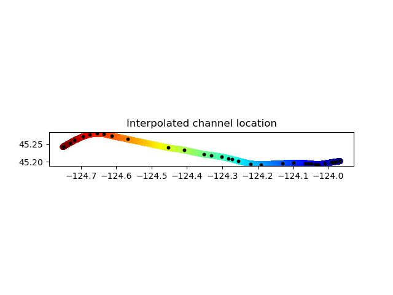
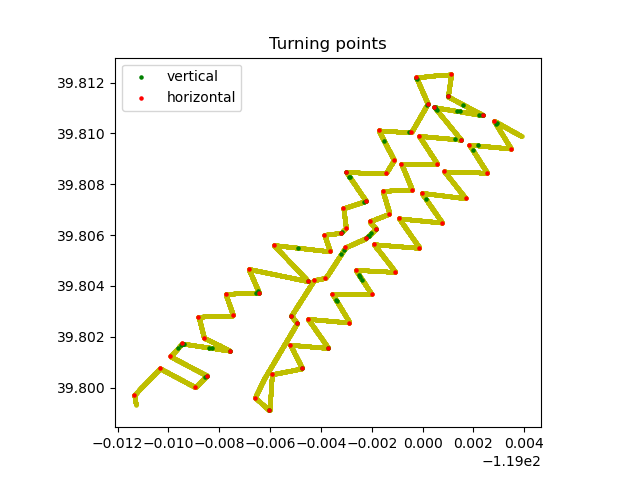

信道分析
=============================================

DASPy的信道属性分析部分： :ref:`信道插值` 进行信道插值定位， :ref:`拐点检测` 查找光纤拐点， :ref:`坏道检测` 检查信道质量。

.. _信道插值:

信道插值
------------------------------

DASPy的信道插值支持联合使用两种类型的数据：包含道号的已知点（即经度&纬度&道号）和不含道号的轨迹点（即经度&纬度），其中已知点是必要输入，轨迹点是用以约束光缆几何形态的可选输入。利用 `通用横轴墨卡托投影 <https://en.wikipedia.org/wiki/Universal_Transverse_Mercator_coordinate_system>`_ （Universal Transverse Mercator，简称UTM），在平面坐标系进行插值后反投影回 `WGS84坐标系 <https://en.wikipedia.org/wiki/World_Geodetic_System>`_ 。

.. note::
    示例数据为RAPID数据集北光缆的坐标，可通过以下方式从在线读取：

    >>> import numpy as np
    >>> txt_url = 'http://piweb.ooirsn.uw.edu/das/processed/metadata/Geometry/OOI_RCA_DAS_channel_location/north_cable_latlon.txt'
    >>> track_pt = np.loadtxt(txt_url)[:, ::-1] # 读入轨迹点，并将两列互换（使经度在纬度前）
    >>> known_pt = np.array([[*track_pt[0], 942], [*track_pt[-1], 32459]]) # 已知第0个轨迹点对应942道，最后一个轨迹点对应32459道，其余轨迹点的道号未知
    
    或从 `<http://piweb.ooirsn.uw.edu/das/processed/metadata/Geometry/OOI_RCA_DAS_channel_location/north_cable_latlon.txt>`_ 下载后读取。

::

    >>> from daspy.advanced_tools.channel import location_interpolation
    >>> interp_ch = location_interpolation(known_pt, track_pt=track_pt, dx=2) # 输入轨迹点和已知道号点，道间距为2m，得到插值结果
    >>> print(interp_ch) # 三列分别为经度、纬度、道号
    [[ -123.96715       45.2023       942.        ]
     [ -123.96717541    45.20229612   943.        ]
     [ -123.96720083    45.20229224   944.        ]
     ...
     [ -124.75097192    45.24242661 32457.        ]
     [ -124.75099513    45.2424183  32458.        ]
     [ -124.75101833    45.24241    32459.        ]]
    >>> 
    >>> import matplotlib.pyplot as plt # 绘图
    >>> plt.scatter(interp_ch[:,0], interp_ch[:,1], c=interp_ch[:,2], cmap='jet')
    >>> plt.scatter(track_pt[:,0], track_pt[:,1], c='k', s=10)
    >>> plt.gca().set_aspect('equal')
    >>> plt.title('Interpolated channel location')
    >>> plt.show()

.. _拐点检测:

拐点检测
------------------------------

DASPy通过两种方法实现光纤拐点检测：通过信道经纬度计算光纤的拐角，或找到波形记录中邻道互相关值低的信道。

通过信道经纬度计算：

.. note::
    示例数据为Brady地热田DAS信道坐标，可通过以下方式从在线读取：

    >>> import numpy as np
    >>> csv_url = 'https://raw.githubusercontent.com/HMZ-03/DASPy-data/main/Brady_DAS_Coordinates.csv'
    >>> geometry = np.loadtxt(csv_url, delimiter=',', skiprows=2, usecols=[5,4,3])
    >>> geometry = geometry[geometry[:,0] != 0] # 排除值为0的空记录
    
    或从 `<https://raw.githubusercontent.com/HMZ-03/DASPy-data/main/Brady_DAS_Coordinates.csv>`_ 下载后读取。

::

    >>> from daspy.advanced_tools.channel import turning_points
    >>> turning_h, turning_v = turning_points(geometry, depth_info=True) # 数据包含深度信息，同时寻找水平拐点和垂直拐点
    >>> 
    >>> import matplotlib.pyplot as plt # 绘图
    >>> plt.scatter(geometry[:, 0], geometry[:, 1], c='y', s=5)
    >>> plt.scatter(geometry[turning_v, 0], geometry[turning_v, 1], c='g', s=5, label='vertical')
    >>> plt.scatter(geometry[turning_h, 0], geometry[turning_h, 1], c='r', s=5, label='horizontal')
    >>> plt.gca().set_aspect('equal')
    >>> plt.title('Turning points')
    >>> plt.legend()
    >>> plt.show()

.. _坏道检测:

坏道检测
------------------------------

光纤线路中有时存在耦合条件较差的区域，如通信光缆中的预留环线，从而产生“坏道”。这些“坏道”通常对应波形图上振幅异常低或异常高的区域。在耦合条件未知的情况下，DASPy可以利用一段DAS记录来检查信道质量，判断出所谓的“坏道”：

.. note::
    示例数据为Ridgecrest DAS记录的15秒交通信号，可从 `<https://data.caltech.edu/records/31emd-wmv98/files/Traffic_noise_figure_4.mat?download=1>`_ 下载，并通过以下方式读取：

    >>> import scipy.io as scio
    >>> data = scio.loadmat('Traffic_noise_figure_4.mat')['Traffic_noise_figure_4'].T
    >>> sec = Section(data, 8, 250)

调用函数检查好道和坏道：

    >>> from daspy.advanced_tools.channel import channel_checking
    >>> good_chn, bad_chn = channel_checking(data)
    >>> print(bad_chn)
    [  11   12   13   14   18   19   20   21   22   23   81   82   83   84
    85   86   87   88   89  142  143  144  145  146  255  256  257  258
    259  260  261  262  263  264  265  266  267  268  269  270  454  455
    456  457  458  459  460  461  462  463  464  465  466  467  468  469
    470  471  472  664  665  666  667  668  669  842  843  844  845  846
    847  848  849  850  851  852  853  854  855  856  857  858  859  860
    861  862  863  864  865  866  867  868  869  870  871 1059 1060 1061
    1062 1063 1064 1065 1066]

直接去除 ``daspy.Section`` 实例中的坏道：

    >>> sec.channel_checking(use=True)
