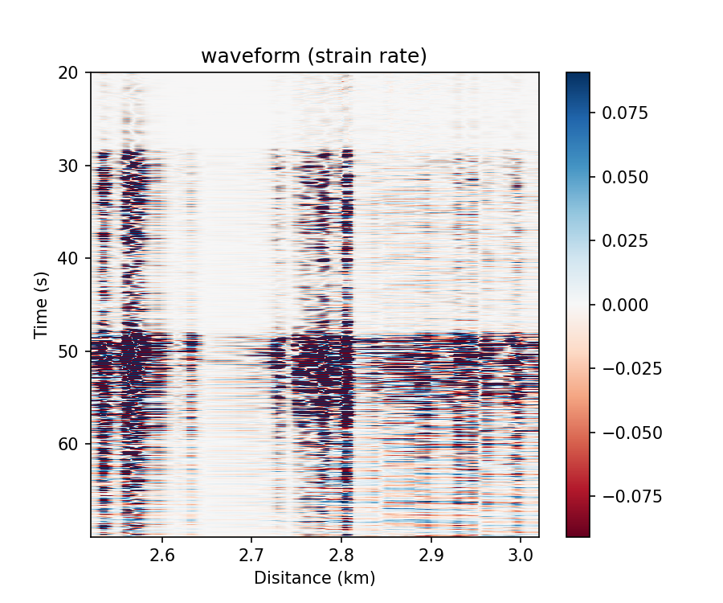

可视化
=============================================

DASPy通过 ``Section`` 类方法/函数 ``plot`` 进行图像绘制。

调用类方法绘制
------------------------------

绘制并显示图像：

    >>> from daspy import read
    >>> sec = read()
    >>> sec.plot() # 绘制波形

在绘制频域图时，可设置 ``kwargs_pro`` 参数用于计算频域属性：

    >>> sec.plot(obj='fk', kwargs_pro=dict(taper=(0.02, 0.05), nfft=(1024, 8192))) # 设置二维余弦尖灭的系数为(0.02,0.05)，二维快速傅里叶变换的点数为(1024, 8192)

在 ``Matplotlib.axes.Axes`` 中绘制图像：

    >>> import matplotlib.pyplot as plt
    >>> fig, ax = plt.subplots(2, 1, figsize=(6,6))
    >>> sec.plot(ax=ax[0], obj='waveform', xmode='channel', tmode='origin', transpose=True, vmax=0.05) # 设置空间轴为道号，时间轴为事件发生的时间，反转默认的x/y轴，设置数据范围为-0.05~0.05
    >>> sec.plot(ax=ax[1], obj='spectrogram', tmode='origin', ylog=True, kwargs_pro=dict(noverlap=156)) # 两个时间点的计算之间重叠的点数为156
    >>> plt.tight_layout()
    >>> plt.show()

.. image:: ../media/plot_in_ax.png
    :width: 500

调用函数绘制
------------------------------

先计算频域特征，对输出进行其他计算后，再使用 ``daspy.basic_tools.visualization.plot`` 函数绘制：

    >>> import numpy as np
    >>> from daspy.basic_tools.visualization import plot
    >>> spec, f = sec.spectrum()
    >>> spec = 10 * np.log10(abs(spec) ** 2) # 将频谱转换为以分贝（dB）为单位，以1为参考值
    >>> plot(spec, obj='spectrum', f=f, xmode='channel') # 设置空间轴为道号，时间轴为事件发生的时间，反转默认的x/y轴

