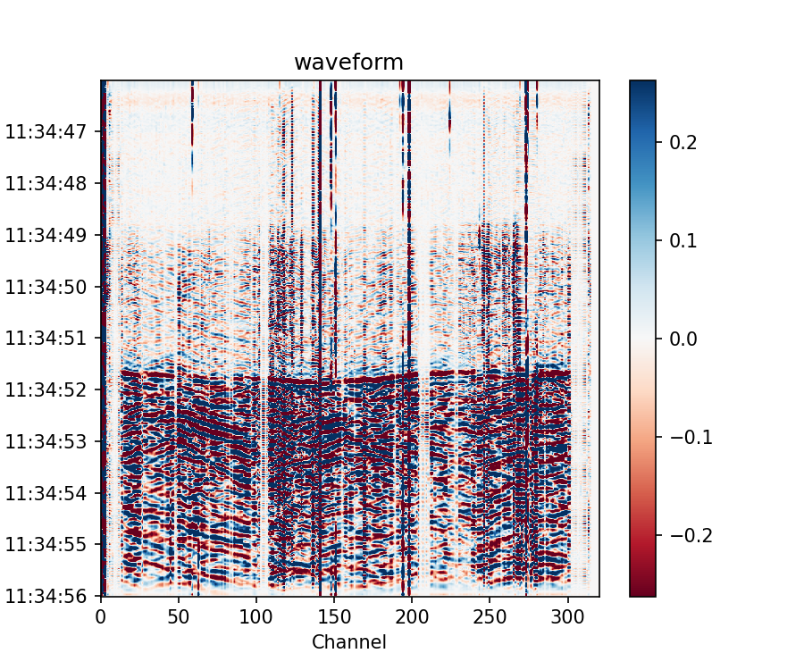
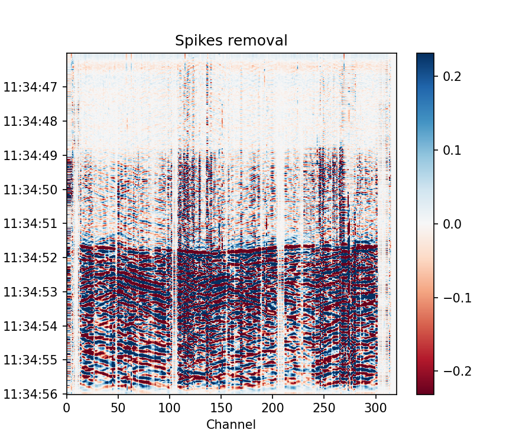

数据去噪
=============================================

DAS主要包括尖峰噪声、共模噪声、随机噪声和相干噪声。DASPy的数据去噪模块提供了 :ref:`去尖峰噪声` 、 :ref:`去共模噪声` 和 :ref:`去随机噪声` 三个功能，相干噪声可使用 :doc:`波场分解` 中提供的方法去除。 

.. _去尖峰噪声:

去尖峰噪声
------------------------------

尖峰噪声表现为波形中异常大的振幅，通常是由激光频率漂移或激光噪声导致的。DASPy使用中值滤波的方法去除尖峰噪声：

.. note::
    示例数据为Stanford DAS-1记录的地震信号，可从 `<https://raw.githubusercontent.com/HMZ-03/DASPy-data/main/Stanford1_20180104_113058.566+0000.sgy>`_ 下载，并通过以下方式读取并预处理：

    >>> from daspy import read, DASDateTime
    >>> sec = read('Stanford1_20180104_113058.566+0000.sgy', ch2=320)
    UserWarning: This data format segy doesn't include channel interval.
    Please set Section.dx manually.
    >>> sec.dx = 8
    >>> sec.start_time = DASDateTime(2018, 1, 4, 11, 30, 58, 566000)
    >>> origin_time = DASDateTime(2018, 1, 4, 11, 34, 44) # 发震时刻
    >>> sec.bandpass(1, 20)
    >>> sec.trimming(tmin=origin_time+2, tmax=origin_time+12)

::

    >>> sec.plot(xmode='channel')

::

    >>> sec.spike_removal()
    >>> sec.plot(xmode='channel')

.. _去共模噪声:

去共模噪声
------------------------------

共模噪声是由光电系统的振动产生的，并同时出现在所有信道上的同相噪声。DASPy采用波形的空间中值或平均值来获得共模噪声，计算信道记录和共模噪声的互相关系数，并从信道记录中去除共模噪声和互相关系数的乘积。

.. note::
    示例数据为RAPID数据集的远海信道记录，可从 `<http://piweb.ooirsn.uw.edu/das/data/Optasense/NorthCable/TransmitFiber/North-C1-LR-P1kHz-GL50m-Sp2m-FS200Hz_2021-11-03T15_06_51-0700/North-C1-LR-P1kHz-GL50m-Sp2m-FS200Hz_2021-11-04T015902Z.h5>`_ 下载，并通过以下方式读取并预处理：

    >>> import numpy as np
    >>> from daspy import read
    >>> sec = read('North-C1-LR-P1kHz-GL50m-Sp2m-FS200Hz_2021-11-04T015902Z.h5')
    >>> sec.trimming(mode=0, xmin=18000, xmax=30000)
    >>> sec.data *= 2 * np.pi / 2 ** 16 # 数据的缩放系数，见sec.headers['Acquisition']['Raw[0]']['attrs']['RawDataUnit']
    >>> sec.phase2strain(1550.12 * 1e-9, 0.78, sec.headers['Acquisition']['Custom']['attrs']['Fibre Refractive Index']) # 将光相移转换为应变
    >>> sec.bandpass(15, 27, detrend=True, taper=0.1)
    >>> sec.trimming(tmin=sec.start_time+20, tmax=sec.start_time+30)

::

    >>> sec.plot()

.. image:: ../media/common_mode_noise_removal0.png
    :width: 600

::

    >>> sec.common_mode_noise_removal()
    >>> sec.plot()

.. _去随机噪声:

去随机噪声
------------------------------

DAS数据中的随机噪声主要是由采样误差和相位噪声等仪器缺陷引起的，DASPy使用曲线变换消除随机噪声：

.. note::
    同 :ref:`去尖峰噪声` 使用的示例数据一致，此处使用去除尖峰噪声后的波形，并通过以下方式读取并预处理：
    >>> from daspy import read, DASDateTime
    >>> sec = read('Stanford1_20180104_113058.566+0000.sgy', ch2=320)
    UserWarning: This data format segy doesn't include channel interval.
    Please set Section.dx manually.
    >>> sec.dx = 8
    >>> sec.start_time = DASDateTime(2018, 1, 4, 11, 30, 58, 566000)
    >>> sec.bandpass(1, 20)
    >>> origin_time = DASDateTime(2018, 1, 4, 11, 34, 44) # 发震时刻
    >>> sec.trimming(tmin=origin_time-10, tmax=origin_time+12)
    >>> sec.spike_removal() # 数据中如有尖峰噪声，需要先去除

使用一段噪声记录作为噪声的基准，在曲波域以软阈值（默认）去除噪声：

    >>> sec_eq = sec.copy().trimming(tmin=origin_time+2, tmax=origin_time+12) # 地震记录
    >>> sec_ns = sec.copy().trimming(tmin=origin_time-10, tmax=origin_time) # 噪声记录
    >>> sec_eq_soft = sec_eq.copy().curvelet_denoising(noise=sec_ns)

同样使用参考噪声记录，在曲波域以硬阈值去除噪声，可以使波形的绝对振幅不变小失真：

    >>> sec_eq_hard = sec_eq.copy().curvelet_denoising(noise=sec_ns, soft_thresh=False)

没有可用的参考噪声记录时，函数会统计曲波系数的拐点以确定噪声的阈值，建议设置 ``pad=0`` 并调节 ``knee_fac`` 参数以减少人工伪影（不推荐此方法）：

    >>> sec_eq_knee = sec_eq.copy().curvelet_denoising(pad=0, knee_fac=0.1)

绘制原波形以及以上三种去噪的效果：

    >>> import matplotlib.pyplot as plt
    >>> fig, ax = plt.subplots(2, 2, figsize=(6,6), sharex=True, sharey=True, dpi=200)
    >>> sec_eq.plot(ax=ax[0,0], xmode='channel', vmax=0.2, xlabel=False, colorbar=False)
    >>> sec_eq_soft.plot(ax=ax[0,1], xmode='channel', vmax=0.2, xlabel=False, ylabel=False, colorbar=False, title='soft thresh')
    >>> sec_eq_hard.plot(ax=ax[1,0], xmode='channel', vmax=0.2, colorbar=False, title='hard thresh')
    >>> sec_eq_knee.plot(ax=ax[1,1], xmode='channel', vmax=0.2, ylabel=False, colorbar=False, title='without reference noise')
    >>> plt.tight_layout()
    >>> plt.show()

