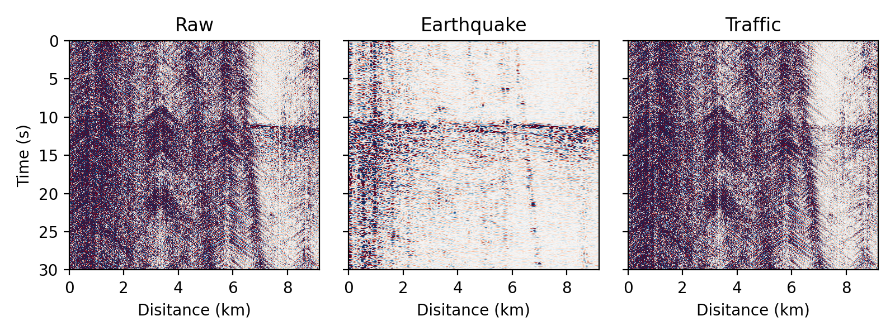

波场分解
=============================================

DAS记录的波场通常成分复杂，我们时常需要将波场按视速度分离，以提取所需要的部分信号，例如分离地震信号和交通信号、分离直达波信号和散射射波信号等。由于DAS良好的等间距特性，DAS记录的波场可以用图像处理技术快速、方便地进行分解。DASPy使用二维快速傅里叶变换（在地震数据处理中称FK变换）和快速离散曲波变换的技术分解DAS波场，两种方法分别称作 :ref:`FK滤波` 和 :ref:`曲波加窗技术` 。

.. _FK滤波:

FK滤波
------------------------------

FK滤波方法是使用二维快速傅里叶变换将数据转换至频率-波数（FK）域，在FK域乘上滤波窗后再反变换回时间-距离域：

.. note::
    示例数据为Ridgecrest DAS记录的30秒M1.79地震信号，可从 `<https://data.caltech.edu/records/31emd-wmv98/files/EQ_raw_figure_1.mat?download=1>`_ 下载，并通过以下方式读取并预处理：

    >>> import scipy.io as scio
    >>> from daspy import Section
    >>> data = scio.loadmat('EQ_raw_figure_1.mat')['EQ_raw'].T #读取数据
    >>> sec = Section(data, 8, 250) # 构建Section实例
    >>> sec.spike_removal() # 去除尖峰噪声
    >>> sec.channel_checking(use=True) # 去除坏道

FK滤波有时会导致伪影，包括波形边缘不连续性引起的边缘伪影，以及FK域的不连续性导致的星状伪影。为了最大限度地减少这些伪影，DASPy在波形上和FK域中的滤波窗上都采用了余弦尖灭（Tukey窗）以确保边缘的连续性。若该地区交通信号的视波速小于1000m/s，地震波的视波速大于1000m/s，则可以以 ``vmin=(800, 1200)`` 来滤除交通信号，第一个输出为地震波，第二个输出为交通信号， ``800`` 和 ``1200`` 为尖灭的边界：

    >>> sec_eq, sec_tf = sec.fk_filter(vmin=(800, 1200), mode='decompose')

绘出原波形、分离出的直达波以及散射波的波形和FK谱：

    >>> import matplotlib.pyplot as plt
    >>> fig, ax = plt.subplots(3, 2, figsize=(6,6), sharex='col', sharey='col', dpi=200)
    >>> sec.plot(ax=ax[0,0], xlabel=False)
    >>> sec_dr.plot(ax=ax[1,0], xlabel=False)
    >>> sec_sc.plot(ax=ax[2,0])
    >>> from daspy.basic_tools.visualization import plot
    >>> vmin, vmax = 0, 2e5
    >>> plot(fk, obj='fk', f=f, k=k, ax=ax[0,1], vmin=vmin, vmax=vmax,xlabel=False)
    >>> plot(fk*mask, obj='fk', f=f, k=k, ax=ax[1,1], vmin=vmin, vmax=vmax, xlabel=False)
    >>> plot(fk*(1-mask), obj='fk', f=f, k=k, ax=ax[2,1], vmin=vmin, ylim=[0,30], vmax=vmax)
    >>> plt.tight_layout()
    >>> plt.show()

.. _曲波加窗技术:

曲波加窗技术
------------------------------

曲波变换可以类似地达到以视波速分解波场的效果：

.. note::
    示例数据的读取和预处理方式同 :ref:`FK滤波` 一致

可以1000m/s的时速度来分裂地震波和交通信号：

    >>> sec_eq, sec_tf = sec.curvelet_windowing(mode='decompose', vmin=1000)

绘出原波形、分离出的直达波以及散射波的波形：

    >>> import matplotlib.pyplot as plt
    >>> fig, ax = plt.subplots(1, 3, figsize=(8,3), sharex='row', sharey='row', dpi=200)
    >>> plot_kwargs = dict(vmax=1, colorbar=False)
    >>> sec.plot(ax=ax[0], title='Raw', **plot_kwargs)
    >>> sec_eq.plot(ax=ax[1], title='Earthquake', ylabel=False, **plot_kwargs)
    >>> sec_tf.plot(ax=ax[2], title='Traffic', ylabel=False, **plot_kwargs)
    >>> plt.tight_layout()
    >>> plt.show()

